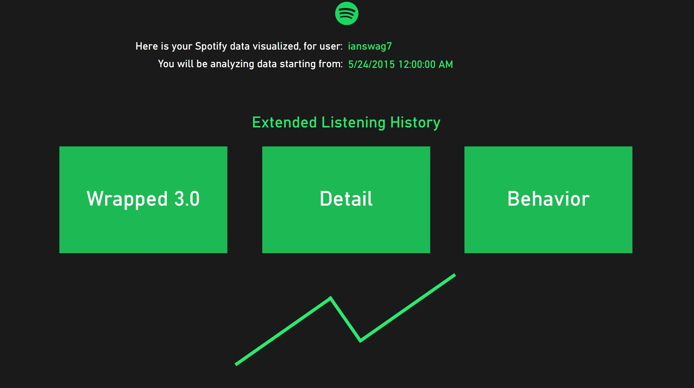
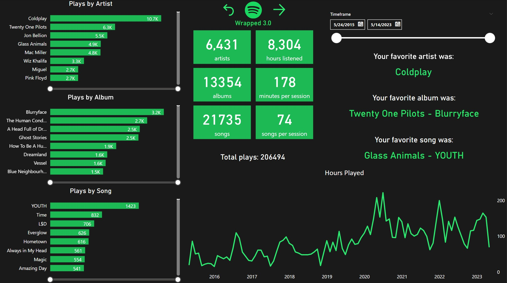
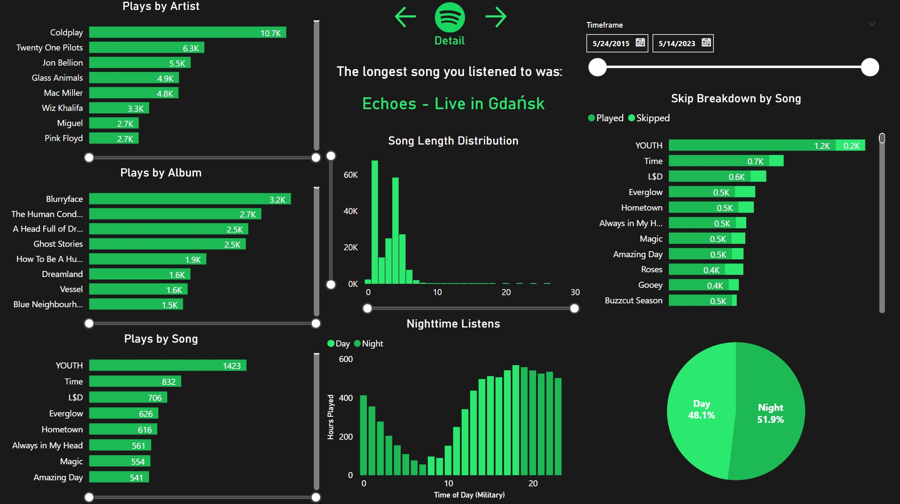
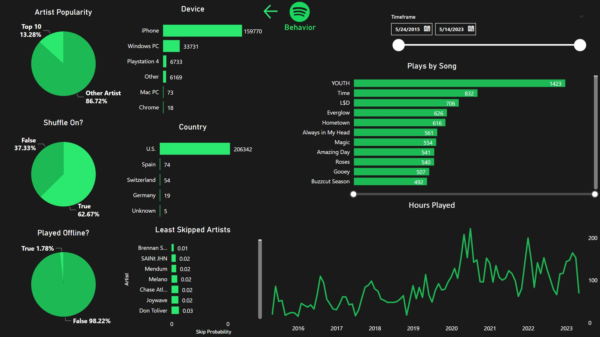

# spotify_wrapped_3.0
I built this Power BI report to analyze my personal Spotify user data for the last 8 years or so. I'm a huge music junkie and wanted to dive deeper than just the surface level analytics such as "top 5 artists" given in the Spotify wrapped yearly. I requested my data from Spotify and they instantly emailed me the previous year's history, but it took about a month to get my full listening history. Spotify sends the data as a bunch of json files, so I just uploaded and appended those together in PowerBI. Overall, really cool project and something I'll do in a few more years once I have more data.

2.0 == 1 year data range

3.0 == full listening history

To request your Spotify listening history, navigate to your account's privacy page, scroll down to "Download your data," select "Extended streaming history," and then request the data.

- Home page 
 
- I wanted to give this more of a website feel, so I added dynamic buttons for page navigation from the main page.

- Main page 
 
- This page displays similar information to the real Spotify wrapped that gets sent to users: top artists, top songs, hours listened, favorite artist, favorite song, etc...

- Detail page 
 
- I kept some of the visuals from the main page to let the user break things down more dynamically.
- I thought the listens by time of day distribution was really interesting - evidently I'm a bit of a night owl.
- Funnily, just about every bucket at the tail end of my song length distribution is Pink Floyd.

- Behavior page 
 
- This breaks down listens by device, shuffle frequency, plays by location, and some other metrics that aren't necessarily related to music preference.